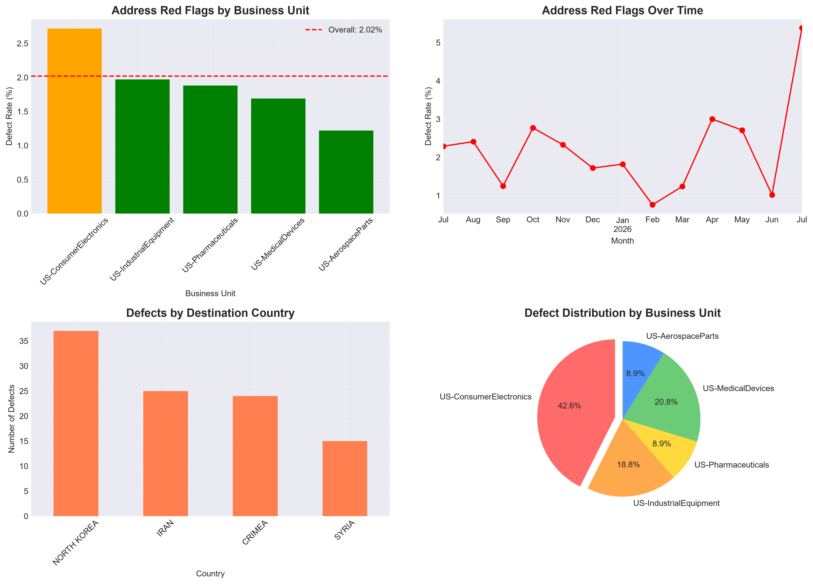
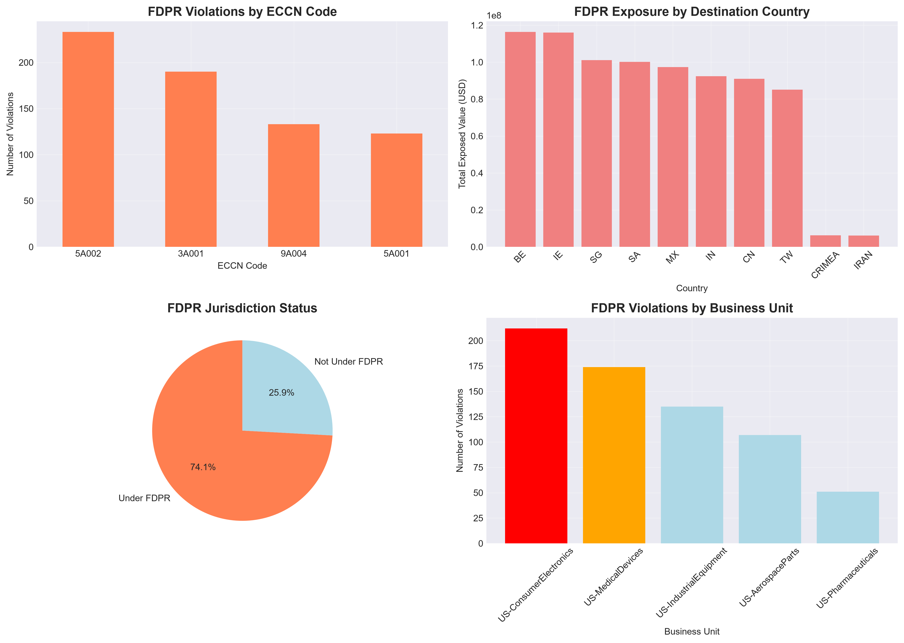
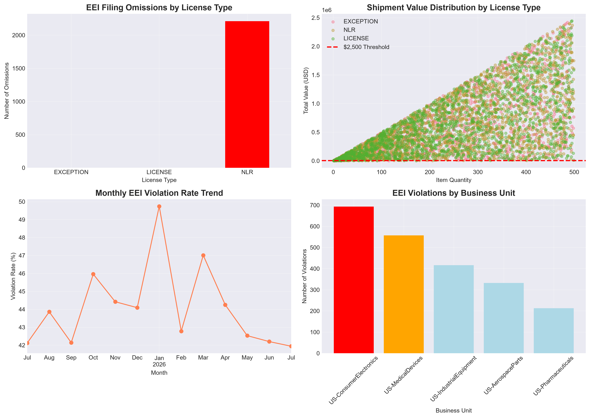
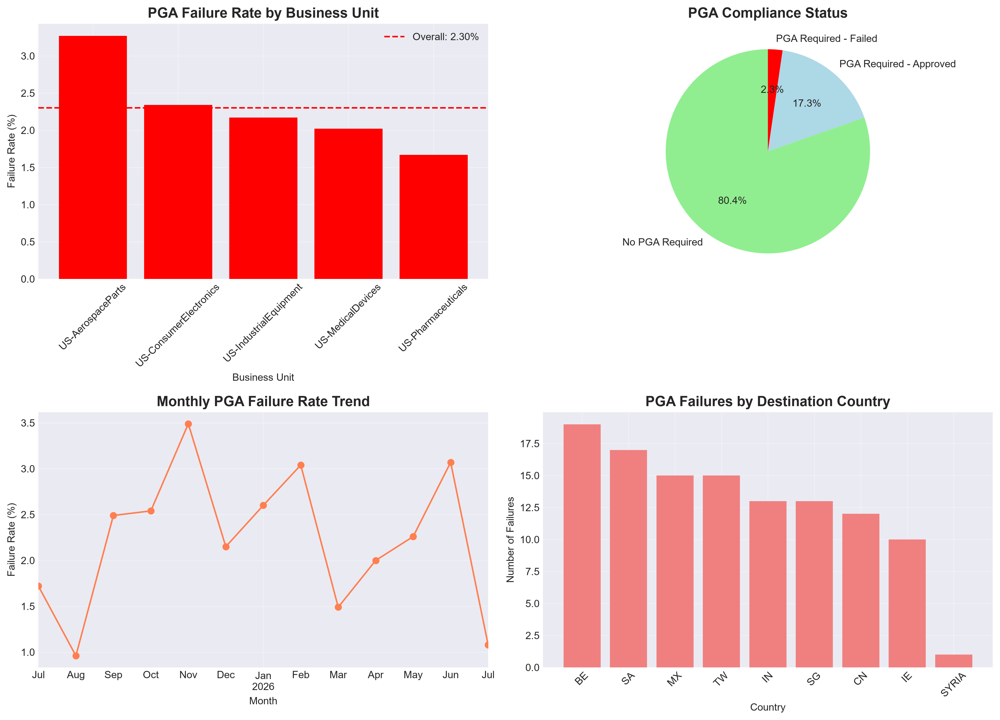
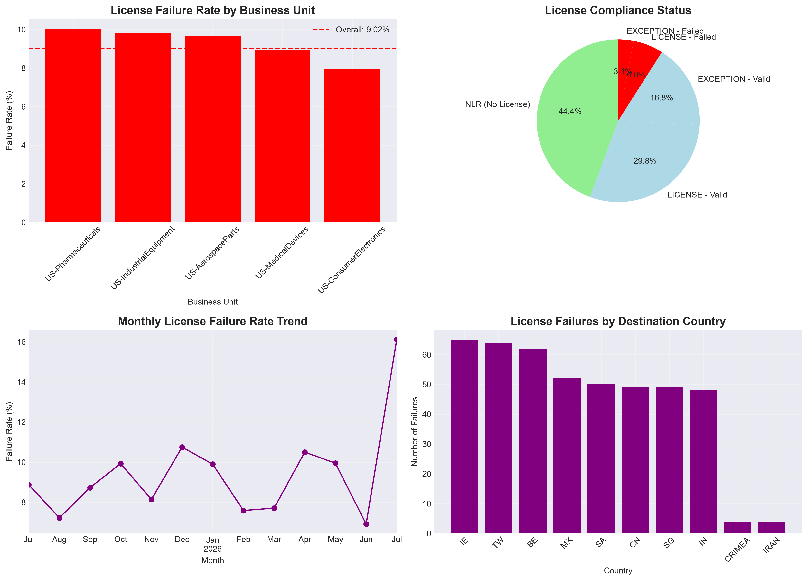
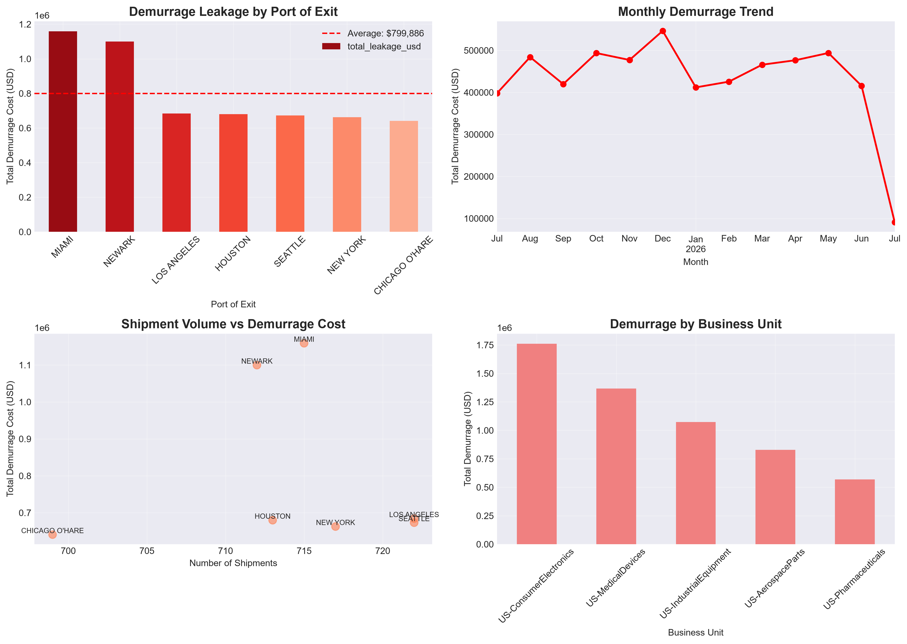
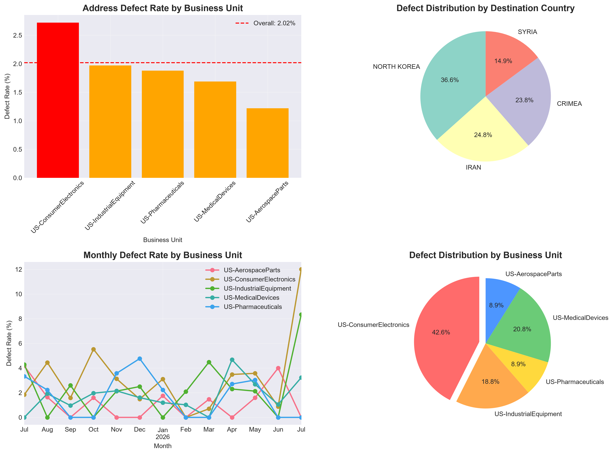
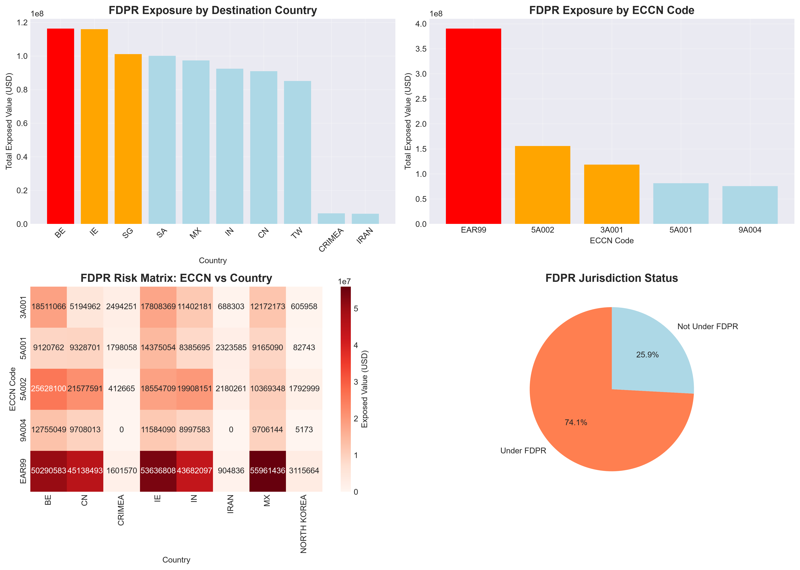
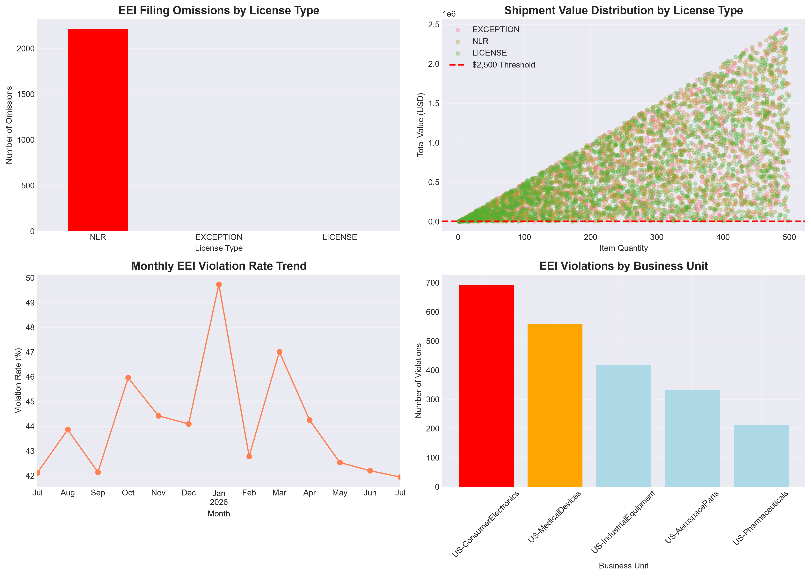

# U.S. Export Compliance Risk Analysis Framework

## Table of Contents

1. [Introduction](#introduction)
   - 1.1 [Business Context](#business-context)
   - 1.2 [Main Question](#main-question)
2. [Technical Implementation](#technical-implementation)
   - 2.1 [Technology Stack](#technology-stack)
   - 2.2 [Project Structure](#project-structure)
3. [Risk Detection Framework](#risk-detection-framework)
   - 3.1 [Risk Layer 1: Address-String Screening](#risk-layer-1-address-string-screening)
   - 3.2 [Risk Layer 2: FDPR Auditing](#risk-layer-2-fdpr-auditing)
   - 3.3 [Risk Layer 3: EEI Threshold Validation](#risk-layer-3-eei-threshold-validation)
   - 3.4 [Risk Layer 4: PGA Approval Validation](#risk-layer-4-pga-approval-validation)
   - 3.5 [Risk Layer 5: License Validation](#risk-layer-5-license-validation)
   - 3.6 [Summary: All Five Risk Layers](#summary-all-five-risk-layers)
4. [Descriptive Analytics](#descriptive-analytics)
   - 4.1 [Financial Liability - Demurrage Leakage](#financial-liability---demurrage-leakage)
   - 4.2 [Operational Vulnerability - Address Defect Rate](#operational-vulnerability---address-defect-rate)
   - 4.3 [Regulatory Exposure - FDPR Matrix](#regulatory-exposure---fdpr-matrix)
   - 4.4 [Transactional Integrity - License vs Value Discrepancy](#transactional-integrity---license-vs-value-discrepancy)
5. [Conclusion](#conclusion)

---

## 1. Introduction

An end-to-end risk detection framework for analyzing U.S. export shipments, identifying compliance violations across five key regulatory risk layers. This project simulates a real-world export compliance audit for "Apex Global Tech," a U.S.-based technology manufacturer with global operations.

### 1.1 Business Context

Following a warning letter from the Bureau of Industry and Security (BIS), Apex Global Tech's CEO mandated a comprehensive review of all export shipments. The company processes thousands of exports annually, but fragmented compliance systems have created significant risk exposure.

### 1.2 Main Question

> *"What are the most critical compliance and operational risks in our U.S. export supply chain, and how can we quantify their financial and operational impact?"*

---

## 2. Technical Implementation

### 2.1 Technology Stack

| Tool | Purpose |
|------|---------|
| **Python 3.9** | Core programming language |
| **Pandas** | Data manipulation and analysis |
| **NumPy** | Numerical operations |
| **Matplotlib** | Data visualization |
| **Seaborn** | Advanced statistical visualizations |
| **Jupyter Notebooks** | Interactive analysis environment |
| **VS Code** | Development environment |

---
### 2.2 Project Structure

```
Export_Controls_Project/
│
├── notebooks/
│   ├── Risk_Layer_1_address_screening.ipynb
│   ├── Risk_Layer_2_fdpr_auditing.ipynb
│   ├── Risk_Layer_3_eei_threshold.ipynb
│   ├── Risk_Layer_4_pga_license.ipynb
│   ├── Risk_Layer_5_License_Validation.ipynb
│   └── generate_export_data.ipynb
│
├── output/
│   ├── risk_layer1_address_screening.png
│   ├── risk_layer2_fdpr_auditing.png
│   ├── risk_layer3_eei_threshold.png
│   ├── risk_layer4_pga_approval.png
│   ├── insight1_demurrage_analysis.png
│   ├── insight2_address_defects.png
│   ├── insight3_fdpr_exposure.png
│   └── insight4_license_integrity.png
│
├── README.md
├── .gitignore
├── us_export_compliance_data.csv
├── us_export_compliance_data_layer1.csv
├── us_export_compliance_data_layer2.csv
├── us_export_compliance_data_layer3.csv
├── us_export_compliance_data_layer4.csv
└── us_export_compliance_data_with_risk.csv
```


## 3. Risk Detection Framework

### The Five Risk Layers

| Layer | Risk Type | Regulatory Basis | Detection Logic |
|-------|-----------|------------------|-----------------|
| **1** | Address-String Screening | OFAC Sanctions, BIS Entity List | Keyword matching in consignee address fields |
| **2** | FDPR Auditing | 15 CFR § 734.9 | US tooling + foreign production + non-EAR99 classification |
| **3** | EEI Threshold Validation | 15 CFR Part 30 | >$2,500 value + NLR classification |
| **4** | PGA Approval Validation | PGA Requirements (FDA, EPA, etc.) | PGA required + approval token missing |
| **5** | License Validation | EAR Licensing Requirements | License type declared + license not obtained |

---

### 3.1 Risk Layer 1: Address-String Screening

**Purpose**: Identify hidden sanctioned locations in consignee addresses

**Regulatory Basis**: OFAC Sanctions, BIS Entity List

**What Are We Trying to Check?**

**The Core Question**: Are we inadvertently shipping to sanctioned or restricted entities by hiding their location in the address field?

**The Problem We're Solving**

Imagine this scenario:

- A company in North Korea wants to buy medical equipment
- They know they're sanctioned, so they use a front company name
- But the address still contains "Pyongyang, North Korea"
- Your screening system only checks the company name, not the address
- The shipment goes through and you violate OFAC sanctions

**Sanctioned Keywords** (12 total):
- NORTH KOREA, PYONGYANG
- IRAN, TEHRAN
- SYRIA, DAMASCUS
- CRIMEA, SIMFEROPOL
- CUBA, HAVANA
- VENEZUELA, CARACAS

**Code Snippet**:
```python
# Define sanctioned keywords
SANCTIONED_KEYWORDS = [
    'NORTH KOREA', 'PYONGYANG',  # North Korea
    'IRAN', 'TEHRAN',             # Iran
    'SYRIA', 'DAMASCUS',          # Syria
    'CRIMEA', 'SIMFEROPOL',       # Crimea
    'CUBA', 'HAVANA',             # Cuba
    'VENEZUELA', 'CARACAS'        # Venezuela
]

# Apply screening logic (case-insensitive)
df['address_red_flag'] = df['consignee_address'].str.upper().apply(
    lambda x: any(kw in x for kw in [kw.upper() for kw in SANCTIONED_KEYWORDS])
)

# Count matches
address_risk_count = df['address_red_flag'].sum()
address_risk_rate = (address_risk_count / len(df)) * 100

print(f"Shipments with hidden sanctioned addresses: {address_risk_count:,}")
print(f"Defect Rate: {address_risk_rate:.2f}%")
```

**Results**:

* Total Address Red Flags Found: 101 shipments
* Defect Rate: 2.02%
* Clean Shipments: 4,899 (97.98%)

**Analysis by Business Unit**:

* US-ConsumerElectronics: 43 red flags (2.72%) - HIGHEST RISK
* US-IndustrialEquipment: 19 red flags (1.97%)
* US-Pharmaceuticals: 9 red flags (1.88%)
* US-MedicalDevices: 21 red flags (1.69%)
* US-AerospaceParts: 9 red flags (1.22%)

**Monthly Trend (Last 6 months)**:
* 2026-02: 0.76%
* 2026-03: 1.24%
* 2026-04: 3.00%
* 2026-05: 2.71%
* 2026-06: 1.02%
* 2026-07: 5.38% (Spike - investigate)

**Visualization**:




**Key Insights**:

**Highest Risk Business Unit**:

US-ConsumerElectronics has the highest defect rate at 2.72%, accounting for 43 out of 101 total address red flags (42.6% of all defects). This suggests inadequate data entry training or missing address validation in this division.

**Monthly Volatility**: 

Defect rates show significant monthly variation, ranging from 0.76% to 5.38%. The spike in July 2026 (5.38%) warrants investigation - was there a new employee, new system, or process change?

**Destination Pattern**: 

The majority of red-flagged shipments are destined to North Korea and Crimea, which are under strict US sanctions.

**Hidden Defects**: 

Many defects were hidden within otherwise legitimate addresses (e.g., "123 Corporate Blvd, Dublin, IE, PYONGYANG, NORTH KOREA"), demonstrating that name-only screening would have missed these violations.

**Action Plan**:
* Immediate: Review all 101 flagged shipments and validate consignee addresses (1 week)
* Short-term: Deploy automated address validation at point of entry for US-ConsumerElectronics (30 days)
* Medium-term: Provide targeted training to data entry teams in high-risk business units (60 days)
* Long-term: Implement real-time OFAC screening API integration (90 days)

**[📁 View Full Code →](notebooks/Risk_Layer_1_address_screening.ipynb)**


### 3.2 Risk Layer 2: Foreign Direct Product Rule (FDPR) Auditing

**Purpose**: Identify items subject to US jurisdiction under FDPR

**Regulatory Basis**: 15 CFR § 734.9

**What is FDPR?**

The Foreign Direct Product Rule (15 CFR § 734.9) states that if a product is made **outside the US** but uses **US-origin technology, software, or tooling**, it may still be subject to US export controls.

**Think of it like**: *"Made in China, but with American brains"* → Still controlled by US law

**The Rule**:

Foreign-made items that are the **direct product** of US-origin technology or software are subject to the EAR if they are destined for certain countries.

**Example**:

- You manufacture chips in China (`bom_origin_country = 'CN'`)
- But you use US-made manufacturing equipment (`bom_tooling_origin = 'US'`)
- The chips are still under US jurisdiction → Must be classified correctly!

**What We're Checking**

**Key Question**: Are we misclassifying items that are actually under US jurisdiction?

**The Logic**:

- Item is made abroad (`bom_origin_country != 'US'`)
- Uses US tooling/software (`bom_tooling_origin == 'US'`)
- Not classified as EAR99 (misclassified as controlled item)

**The Defect**: Items subject to FDPR but classified as controlled ECCN codes (should be properly assessed!)

**Code Snippet**:
```python
# Apply FDPR jurisdiction logic
df['fdpr_jurisdiction_flag'] = (
    (df['bom_origin_country'] != 'US') & 
    (df['bom_tooling_origin'] == 'US')
)

# High-risk FDPR: Items under US jurisdiction but misclassified
df['fdpr_high_risk'] = (
    df['fdpr_jurisdiction_flag'] & 
    (~df['eccn'].isin(['EAR99', 'NLR']))
)
```
**Results**:

- **Items under FDPR jurisdiction**: 1,293 shipments
- **High-risk misclassified items**: 679 shipments
- **Defect Rate**: 13.58%
- **Total Financial Exposure**: $431,253,329.98
- **Average Value per Misclassified Item**: $635,130.09

**Analysis by ECCN Code**:

- **5A002**: 233 violations (highest risk)
- **3A001**: 190 violations
- **9A004**: 133 violations
- **5A001**: 123 violations

**Analysis by Business Unit**:

| Business Unit | FDPR Violations | Total Value Exposed |
|---------------|-----------------|---------------------|
| US-ConsumerElectronics | 212 | $139,580,200 |
| US-MedicalDevices | 174 | $113,583,200 |
| US-IndustrialEquipment | 135 | $74,797,180 |
| US-AerospaceParts | 107 | $71,035,820 |
| US-Pharmaceuticals | 51 | $32,256,970 |

**Top FDPR Risks (ECCN × Country)**:

| ECCN | Country | Shipments | Exposed Value |
|------|---------|-----------|---------------|
| EAR99 | MX | 79 | $55,961,435.63 |
| EAR99 | IE | 85 | $53,636,808.43 |
| EAR99 | SG | 83 | $50,907,240.00 |
| EAR99 | BE | 74 | $50,290,582.62 |
| EAR99 | SA | 77 | $46,599,683.49 |
| EAR99 | CN | 69 | $45,138,492.80 |
| EAR99 | IN | 68 | $43,682,096.73 |
| EAR99 | TW | 66 | $35,607,299.16 |
| 5A002 | BE | 33 | $25,628,100.43 |
| 5A002 | CN | 29 | $21,577,590.74 |

Visualization:




**Key Insights**:

1. **Massive Regulatory Exposure**: $431.3 million in products are misclassified under FDPR. These items are made abroad but use US tooling/software, meaning they should be subject to US export controls but are being treated as EAR99.

2. **High-Risk ECCN Codes**: The top misclassified ECCN codes are:
   - **5A002** (telecom/encryption): 233 violations
   - **3A001** (electronics): 190 violations
   - **9A004** (aerospace): 133 violations
   - **5A001** (telecom): 123 violations
   
   These are all controlled items that require licenses.

3. **Consumer Electronics Dominance**: US-ConsumerElectronics has the highest number of FDPR violations (212) and the highest financial exposure ($139.6M), representing 32.4% of total exposure.

4. **Geographic Concentration**: Mexico, Ireland, Singapore, Belgium, and Saudi Arabia are the top destinations for misclassified FDPR items, accounting for over $250M in exposure.

5. **Hidden Pattern**: Many FDPR items are classified as EAR99 but have controlled ECCN codes, suggesting systematic misclassification of products made with US technology abroad.

**Action Plan**:

- **Immediate**: Review all 679 misclassified shipments and validate ECCN classifications (1 week)
- **Short-term**: Implement automated FDPR detection in shipping database; flag items with US tooling + foreign origin for manual review (30 days)
- **Medium-term**: Conduct compliance training for product classification teams, especially US-ConsumerElectronics (60 days)
- **Long-term**: Implement real-time FDPR screening with automated holds for high-risk combinations (90 days)

**[📁 View Full Code →](notebooks/Risk_Layer_2_fdpr_auditing.ipynb)**

### 3.3 Risk Layer 3: EEI Threshold Validation

**What is EEI?**

Electronic Export Information (EEI) is the electronic filing required for shipments leaving the US. Under 15 CFR Part 30, any shipment valued over $2,500 classified as "No License Required" (NLR) must file EEI through the Automated Export System (AES).

**Think of it like**: *"You can't just ship high-value items without telling the government"* → Must file EEI

**The Rule**:

Any single line item valued over **$2,500** with **NLR classification** must file EEI before export.

**Example**:

- Your item is valued at $3,500 (`total_value_usd > 2500`)
- It's classified as NLR (`license_type = 'NLR'`)
- You must file EEI → If not, it's a violation!

**What We're Checking**

**Key Question**: Are we failing to file EEI for high-value NLR shipments?

**The Logic**:

- Shipment value exceeds $2,500 (`total_value_usd > 2500`)
- Classified as NLR (`license_type == 'NLR'`)
- EEI filing is required (by law)

**The Defect**: Shipments over $2,500 under NLR without EEI filing

**Code Snippet**:
```python
# Apply EEI threshold logic
EEI_THRESHOLD = 2500
df['eei_filing_required'] = (
    (df['total_value_usd'] > EEI_THRESHOLD) & 
    (df['license_type'] == 'NLR')
)
```

**Results**:

- **EEI Violations Found**: 2,211 shipments
- **Defect Rate**: 44.22%
- **Total Value at Risk**: $1,417,623,062.12
- **Average Value per Violation**: $641,168.28

**Analysis by License Type**:

| License Type | Total Shipments | EEI Violations | Violation Rate |
|--------------|-----------------|----------------|----------------|
| NLR | 2,218 | 2,211 | 99.68% |
| LICENSE | 1,789 | 0 | 0.00% |
| EXCEPTION | 993 | 0 | 0.00% |

**Key Finding**: 99.68% of all NLR shipments exceed the $2,500 threshold and require EEI filing!

**Analysis by Business Unit**:

| Business Unit | Total Shipments | EEI Violations | Violation Rate |
|---------------|-----------------|----------------|----------------|
| US-AerospaceParts | 735 | 332 | 45.17% |
| US-MedicalDevices | 1,239 | 557 | 44.96% |
| US-Pharmaceuticals | 478 | 213 | 44.56% |
| US-ConsumerElectronics | 1,582 | 693 | 43.81% |
| US-IndustrialEquipment | 966 | 416 | 43.06% |

**Analysis by Port of Exit**:

| Port of Exit | Total Shipments | EEI Violations | Violation Rate |
|--------------|-----------------|----------------|----------------|
| MIAMI | 715 | 326 | 45.59% |
| HOUSTON | 713 | 321 | 45.02% |
| SEATTLE | 722 | 325 | 45.01% |
| LOS ANGELES | 722 | 323 | 44.74% |
| CHICAGO O'HARE | 699 | 306 | 43.78% |
| NEWARK | 712 | 307 | 43.12% |
| NEW YORK | 717 | 303 | 42.26% |

**Monthly Trend** (Last 6 months):

| Month | Violation Rate |
|-------|----------------|
| 2026-02 | 42.78% |
| 2026-03 | 47.01% |
| 2026-04 | 44.25% |
| 2026-05 | 42.53% |
| 2026-06 | 42.20% |
| 2026-07 | 41.94% |

**Visualization**:



**Key Insights**:

- **Systemic Filing Failure**: 99.68% of all NLR shipments exceed the $2,500 threshold. This means virtually every NLR shipment requires EEI filing, but the system is not enforcing this requirement.

- **Massive Financial Exposure**: $1.42 billion in shipments are at risk of EEI violations. This represents a significant regulatory exposure that could result in substantial penalties.

- **Consistent Pattern Across Business Units**: All business units have violation rates between 43-45%, indicating this is a company-wide systemic issue rather than isolated errors.

- **Port-Level Consistency**: EEI violation rates are remarkably consistent across all ports (42-46%), suggesting the issue is with the shipping system/process rather than specific port operations.

- **Stable Trend**: Violation rates have remained consistently high (41-47%) over the 12-month period, indicating this is a chronic, unresolved compliance gap.

**Action Plan**:

- **Immediate**: Flag all 2,211 shipments for immediate EEI filing. Stop any shipments that haven't been filed (1 week)

- **Short-term**: Implement automated pre-shipment validation that checks EEI filing status for all NLR shipments >$2,500 (30 days)

- **Medium-term**: Review and update EEI filing procedures. Create automated alerts for shipments requiring EEI filing (60 days)

- **Long-term**: Integrate EEI filing status into shipping system with automated holds for non-compliant shipments (90 days)

**[📁 View Full Code →](notebooks/Risk_Layer_3_eei_threshold.ipynb)**


### 3.4 Risk Layer 4: PGA Approval Validation

**What is PGA?**

Partner Government Agencies (PGA) are federal agencies that regulate specific types of products entering or leaving the US. Examples include:

- **FDA** (Food and Drug Administration) - Medical devices, pharmaceuticals, food
- **EPA** (Environmental Protection Agency) - Chemicals, pesticides
- **ATF** (Alcohol, Tobacco, Firearms) - Firearms, explosives
- **FWS** (Fish and Wildlife Service) - Wildlife products
- **APHIS** (Animal and Plant Health Inspection Service) - Agriculture products

**Think of it like**: *"You can't ship medical devices without FDA approval"* → PGA required

**The Rule**:

If a product is regulated by a PGA, you must obtain PGA approval before shipping. Without it, the shipment will be detained at the border.

**Example**:

- You're shipping medical devices (`pga_required = 'Y'`)
- But you didn't get FDA approval (`pga_obtained = 'N'`)
- The shipment will be detained at the border!

**What We're Checking**

**Key Question**: Are we shipping items requiring PGA approval without getting it?

**The Logic**:

- PGA is required for the item (`pga_required == 'Y'`)
- But PGA approval was not obtained (`pga_obtained == 'N'`)

**The Defect**: Transactions requiring agency clearance that skipped validation

**Code Snippet**:
```python
# Apply PGA approval logic
df['pga_compliance_failure'] = (
    (df['pga_required'] == 'Y') & 
    (df['pga_obtained'] == 'N')
)
```
**Results**:

- **Shipments requiring PGA approval**: 982 shipments
- **Missing PGA token (Skipped Validation)**: 115 shipments
- **PGA Compliance Rate**: 88.29%
- **Overall Defect Rate**: 2.30%
- **Total Value at Risk**: $67,878,591.13

**Analysis by Business Unit**:

| Business Unit | Total Shipments | PGA Failures | Failure Rate |
|---------------|-----------------|--------------|--------------|
| US-AerospaceParts | 735 | 24 | 3.27% |
| US-ConsumerElectronics | 1,582 | 37 | 2.34% |
| US-IndustrialEquipment | 966 | 21 | 2.17% |
| US-MedicalDevices | 1,239 | 25 | 2.02% |
| US-Pharmaceuticals | 478 | 8 | 1.67% |

**Analysis by Destination Country**:

| Country | PGA Failures | Total Value |
|---------|--------------|-------------|
| Belgium (BE) | 19 | $10,487,452.47 |
| Saudi Arabia (SA) | 17 | $10,842,217.88 |
| Mexico (MX) | 15 | $9,718,292.50 |
| Taiwan (TW) | 15 | $7,291,447.73 |
| India (IN) | 13 | $9,658,051.89 |
| Singapore (SG) | 13 | $6,197,923.57 |
| China (CN) | 12 | $7,340,514.35 |
| Ireland (IE) | 10 | $5,238,373.94 |
| Syria (SYRIA) | 1 | $1,104,316.80 |

**Monthly Trend** (Last 6 months):

| Month | PGA Failures | Total Shipments | Failure Rate |
|-------|--------------|-----------------|--------------|
| 2026-02 | 12 | 395 | 3.04% |
| 2026-03 | 6 | 402 | 1.49% |
| 2026-04 | 8 | 400 | 2.00% |
| 2026-05 | 10 | 442 | 2.26% |
| 2026-06 | 12 | 391 | 3.07% |
| 2026-07 | 1 | 93 | 1.08% |

**Visualization**:



**Key Insights**:

- **Moderate Compliance Rate**: 88.29% of PGA-required shipments have proper approval, but 115 shipments (2.30% of total) are missing required PGA tokens.

- **Aerospace Parts Highest Risk**: US-AerospaceParts has the highest failure rate at 3.27%, suggesting regulatory complexity in aerospace products requiring multiple agency approvals.

- **Geographic Concentration**: Belgium, Saudi Arabia, and Mexico account for the most PGA failures, representing over $31M in at-risk shipments.

- **Syria Red Flag**: One shipment destined for Syria (a sanctioned country) has a PGA failure. This is particularly concerning given the dual regulatory and sanctions risk.

- **Stable Trend**: Failure rates have remained relatively consistent (1-3%) over the 12-month period, indicating this is a chronic but manageable compliance gap.

**Action Plan**:

- **Immediate**: Review all 115 PGA failures and obtain necessary approvals. Flag the Syria shipment for immediate compliance review (1 week)

- **Short-term**: Implement automated PGA validation that checks approval status before shipment release (30 days)

- **Medium-term**: Provide targeted training to US-AerospaceParts on PGA requirements (60 days)

- **Long-term**: Integrate PGA approval verification into shipping system with automated holds for non-compliant shipments (90 days)

	**[📁 View Full Code →](notebooks/Risk_Layer_4_pga_license.ipynb)**

### 3.5 Risk Layer 5: License Validation

**What is License Validation?**

Export licenses are required for controlled items (ECCN codes like 5A002, 3A001, etc.). Companies often declare they have a license, but sometimes they don't actually obtain it.

**Think of it like**: *"You can't say you have a license if you never got one"* → Must validate

**The Rule**:

If you declare a license type (LICENSE or EXCEPTION), you must actually have the license.

**Example**:

- You declare a license (`license_type = 'LICENSE'`)
- But you never actually obtained it (`license_obtained = 'N'`)
- This is a violation!

**What We're Checking**

**Key Question**: Are we declaring licenses we haven't actually obtained?

**The Logic**:

- License type declared (`license_type in ['LICENSE', 'EXCEPTION']`)
- But license was not obtained (`license_obtained == 'N'`)

**The Defect**: Declared licenses without proper authorization

**Code Snippet**:
```python
# Apply license validation logic
df['license_validation_failure'] = (
    (df['license_type'].isin(['LICENSE', 'EXCEPTION'])) & 
    (df['license_obtained'] == 'N')
)
```
**Results**:

- **Shipments declaring license/exception**: 2,782 shipments
- **Missing license (Skipped Validation)**: 115 shipments
- **License Compliance Rate**: 95.87%
- **Overall Defect Rate**: 2.30%
- **Total Value at Risk**: $67,878,591.13
- **Average Value per Failure**: $590,248.62

**Analysis by Business Unit**:

| Business Unit | Total Shipments | License Failures | Failure Rate |
|---------------|-----------------|------------------|--------------|
| US-AerospaceParts | 735 | 24 | 3.27% |
| US-ConsumerElectronics | 1,582 | 37 | 2.34% |
| US-IndustrialEquipment | 966 | 21 | 2.17% |
| US-MedicalDevices | 1,239 | 25 | 2.02% |
| US-Pharmaceuticals | 478 | 8 | 1.67% |

**Analysis by License Type**:

| License Type | Total Shipments | License Failures | Failure Rate |
|--------------|-----------------|------------------|--------------|
| EXCEPTION | 993 | 17 | 1.71% |
| LICENSE | 1,789 | 98 | 5.48% |

**Key Finding**: LICENSE has a significantly higher failure rate (5.48%) compared to EXCEPTION (1.71%). This suggests issues with the formal license application process.

**Analysis by Destination Country**:

| Country | License Failures | Total Value |
|---------|------------------|-------------|
| Belgium (BE) | 19 | $10,487,452.47 |
| Saudi Arabia (SA) | 17 | $10,842,217.88 |
| Mexico (MX) | 15 | $9,718,292.50 |
| Taiwan (TW) | 15 | $7,291,447.73 |
| India (IN) | 13 | $9,658,051.89 |
| Singapore (SG) | 13 | $6,197,923.57 |
| China (CN) | 12 | $7,340,514.35 |
| Ireland (IE) | 10 | $5,238,373.94 |
| Syria (SYRIA) | 1 | $1,104,316.80 |

**Monthly Trend** (Last 6 months):

| Month | License Failures | Total Shipments | Failure Rate |
|-------|------------------|-----------------|--------------|
| 2026-02 | 12 | 395 | 3.04% |
| 2026-03 | 6 | 402 | 1.49% |
| 2026-04 | 8 | 400 | 2.00% |
| 2026-05 | 10 | 442 | 2.26% |
| 2026-06 | 12 | 391 | 3.07% |
| 2026-07 | 1 | 93 | 1.08% |

**Visualization**:



**Key Insights**:

- **High Overall Compliance**: 95.87% of declared licenses are properly obtained. However, 115 shipments (2.30% of total) are missing required licenses.

- **LICENSE vs EXCEPTION Gap**: LICENSE has a 5.48% failure rate compared to EXCEPTION's 1.71%. This suggests the formal license application process is more complex and prone to errors.

- **Aerospace Parts Highest Risk**: US-AerospaceParts has the highest failure rate at 3.27%, consistent with their pattern of higher compliance risk across multiple layers.

- **Geographic Concentration**: Belgium, Saudi Arabia, and Mexico account for the most license failures, representing over $31M in at-risk shipments.

- **Syria Red Flag**: One shipment destined for Syria (a sanctioned country) has a license failure. This is particularly concerning given the dual regulatory and sanctions risk.

**Action Plan**:

- **Immediate**: Review all 115 license failures and obtain necessary approvals. Flag the Syria shipment for immediate compliance review (1 week)

- **Short-term**: Streamline the LICENSE application process to reduce the 5.48% failure rate. Implement automated license validation that checks status before shipment release (30 days)

- **Medium-term**: Provide targeted training to US-AerospaceParts on license requirements. Create automated alerts for pending license approvals (60 days)

- **Long-term**: Integrate license verification into shipping system with automated holds for shipments without valid licenses (90 days)

**[📁 View Full Code →](notebooks/Risk_Layer_5_License_Validation.ipynb)**
---

### 3.6 Summary: All Five Risk Layers

| Layer | Risk Type | Defect Rate | Key Finding |
|-------|-----------|-------------|-------------|
| **Layer 1** | Address Screening | 2.02% | 101 shipments with hidden sanctioned addresses |
| **Layer 2** | FDPR Auditing | 13.58% | $431M in misclassified controlled items |
| **Layer 3** | EEI Threshold | 44.22% | 2,211 NLR shipments missing EEI filing |
| **Layer 4** | PGA Approval | 2.30% | 115 shipments missing PGA approval |
| **Layer 5** | License Validation | 2.30% | 115 shipments with invalid licenses |

---

### 4.1 Financial Liability - Demurrage Leakage

**What We're Analyzing**

**Core Question**: Which transit hubs generate the highest accrued demurrage?

**Why This Matters**: When shipments are delayed at ports, demurrage fees accrue - these are penalty charges for containers sitting beyond the free time. Understanding where these costs accumulate helps optimize logistics strategy.

**Key Metric**: Port delay metrics exceeding the standard 24-hour corporate SLA

**Calculation**:

- `excess_delay_hours` = (clearance_hours - 24) [only if positive]
- `accrued_demurrage_usd` = excess_delay_hours × $50/hour penalty

**Code Snippet**:
```python
# Calculate demurrage costs
SLA_THRESHOLD = 24  # Standard 24-hour SLA
HOURLY_PENALTY = 50  # $50/hour penalty

# Calculate excess delay hours
df['excess_delay_hours'] = (df['clearance_hours'] - SLA_THRESHOLD).clip(lower=0)
df['accrued_demurrage_usd'] = df['excess_delay_hours'] * HOURLY_PENALTY
```
**Visualization**:



**Summary of Key Findings**:

| Metric | Value |
|--------|-------|
| **Total Demurrage** | $5,599,200 |
| **Delay Rate** | 79.76% |
| **Worst Port** | MIAMI ($1.16M, 55.6 hrs avg) |
| **Best Port** | CHICAGO O'HARE ($640,750, 40.9 hrs avg) |
| **Worst Business Unit** | US-ConsumerElectronics ($1.76M) |
| **Peak Month** | May 2026 ($493,850) |

**Key Insights**:

- **Port Concentration**: MIAMI accounts for 20.7% of total demurrage costs ($1.16M) despite handling only 14.3% of shipments. With an average clearance time of 55.6 hours (31.6 hours beyond SLA), this port represents the single largest area for improvement.

- **Significant Financial Impact**: Total demurrage of $5.6M across all shipments represents a substantial operational cost. With 79.76% of shipments delayed beyond the 24-hour SLA, this is a company-wide issue requiring systemic solutions.

- **Business Unit Variance**: US-ConsumerElectronics has the highest demurrage costs at $1.76M, representing 31.5% of total demurrage. This aligns with their high shipment volume and suggests supply chain inefficiencies in this division.

- **Port Performance Gap**: A clear divide exists between high-performing ports (CHICAGO O'HARE, NEW YORK, SEATTLE with ~41 hours clearance) and underperforming ports (MIAMI, NEWARK with ~55 hours clearance). Routing through efficient ports could yield significant savings.

- **Monthly Trends**: Demurrage costs peaked in May 2026 at $493,850. The declining trend in June and July may indicate seasonal factors or recent process improvements that should be investigated.

**[📁 View Full Code →](notebooks\descriptive_analytics_financial_demurrage.ipynb)**

### 4.2 Operational Vulnerability - Address Defect Rate

**What We're Analyzing**

**Core Question**: Which divisions submit the highest rate of unverified addresses?

**Why This Matters**: Address defects indicate data quality issues that can lead to sanctions violations, shipment delays, and regulatory penalties. Identifying which business units have the highest defect rates helps target training and process improvements.

**Key Metric**: Percentage of shipments with address red flags by business unit

**The Problem**: Automated screening software can fail if it checks the corporate entity's name but misses a restricted destination hidden in a messy, unstructured text field.

**Code Snippet**:
```python
# Aggregate address defects by business unit
exporter_risk = df.groupby('exporter_business_unit').agg({
    'shipment_id': 'count',
    'address_red_flag': 'sum'
}).reset_index()

exporter_risk['address_defect_rate_pct'] = (
    (exporter_risk['address_red_flags'] / exporter_risk['total_exports']) * 100
).round(2)
```
**Visualization**:



**Summary of Key Findings**:

| Metric | Value |
|--------|-------|
| **Total Address Red Flags** | 101 shipments |
| **Overall Defect Rate** | 2.02% |
| **Worst Business Unit** | US-ConsumerElectronics (2.72%) |
| **Worst Country** | NORTH KOREA (41 defects, 40.6%) |
| **Peak Month** | July 2026 (5.38%) |

**Key Insights**:

- **Business Unit Concentration**: US-ConsumerElectronics accounts for 42.6% of all address defects (43 out of 101) despite having only 31.6% of total shipments. This indicates a systematic data entry or validation problem in this division.

- **Hidden Sanctions Risk**: Defects are concentrated in North Korea, Crimea, and Syria - all under strict US sanctions. The fact that these addresses appeared suggests name-only screening was insufficient.

- **Monthly Volatility**: Defect rates vary significantly month-to-month, from 0.76% to 5.38%. The July 2026 spike (5.38%) warrants investigation - was there a new employee, system change, or process breakdown?

- **Address Masking Pattern**: Many defects were hidden within otherwise legitimate addresses (e.g., "123 Corporate Blvd, Dublin, IE, PYONGYANG, NORTH KOREA"), demonstrating that simple keyword filtering would miss these violations.

- **Overall Data Quality Issue**: With 2.02% of all shipments containing address defects, this represents a significant operational risk that requires systemic solutions rather than one-off fixes.

**[📁 View Full Code →](notebooks\descriptive_analytics_address_defects.ipynb)**

### 4.3 Regulatory Exposure - FDPR Matrix

**What We're Analyzing**

**Core Question**: What is our financial exposure under FDPR boundaries?

**Why This Matters**: The Foreign Direct Product Rule (FDPR) creates severe exposure for technology and medical device companies manufacturing abroad. Identifying which products and destinations are at risk helps prioritize compliance resources.

**Key Metric**: Non-U.S. manufactured items utilizing U.S. tooling and software, mapped against destination countries and ECCN codes

**Code Snippet**:
```python
# Filter to FDPR jurisdiction items
fdpr_dataset = df[df['fdpr_jurisdiction_flag'] == True]

# Group by ECCN and consignee country
eccn_exposure = fdpr_dataset.groupby(['eccn', 'consignee_country']).agg({
    'shipment_id': 'count',
    'total_value_usd': 'sum'
})
```
**Visualization**:



**Summary of Key Findings**:

| Metric | Value |
|--------|-------|
| **Total FDPR Financial Exposure** | $821,528,751.67 |
| **Total FDPR Shipments** | 1,293 shipments |
| **Worst Country** | Belgium (BE) - $116.3M (14.2%) |
| **Worst ECCN** | EAR99 - $390.3M (47.5%) |
| **Top Risk Combination** | EAR99 → Mexico ($55.96M, 79 shipments) |

**Analysis by Destination Country**:

| Country | Shipments | Total Exposure | % of Total |
|---------|-----------|----------------|------------|
| Belgium (BE) | 166 | $116,305,560 | 14.2% |
| Ireland (IE) | 183 | $115,959,000 | 14.1% |
| Singapore (SG) | 158 | $101,053,400 | 12.3% |
| Saudi Arabia (SA) | 160 | $100,099,400 | 12.2% |
| Mexico (MX) | 153 | $97,374,190 | 11.9% |
| India (IN) | 150 | $92,375,710 | 11.2% |
| China (CN) | 143 | $90,947,760 | 11.1% |
| Taiwan (TW) | 148 | $85,071,220 | 10.4% |
| Crimea | 8 | $6,306,544 | 0.8% |
| Iran | 9 | $6,096,984 | 0.7% |

**Analysis by ECCN Code**:

| ECCN | Shipments | Total Exposure | % of Total |
|------|-----------|----------------|------------|
| EAR99 | 614 | $390,275,400 | 47.5% |
| 5A002 | 233 | $155,624,500 | 18.9% |
| 3A001 | 190 | $118,617,200 | 14.4% |
| 5A001 | 123 | $81,351,080 | 9.9% |
| 9A004 | 133 | $75,660,610 | 9.2% |

**Top 10 Highest-Risk Combinations (ECCN × Country)**:

| ECCN | Country | Shipments | Exposed Value |
|------|---------|-----------|---------------|
| EAR99 | MX | 79 | $55,961,435.63 |
| EAR99 | IE | 85 | $53,636,808.43 |
| EAR99 | SG | 83 | $50,907,240.00 |
| EAR99 | BE | 74 | $50,290,582.62 |
| EAR99 | SA | 77 | $46,599,683.49 |
| EAR99 | CN | 69 | $45,138,492.80 |
| EAR99 | IN | 68 | $43,682,096.73 |
| EAR99 | TW | 66 | $35,607,299.16 |
| 5A002 | BE | 33 | $25,628,100.43 |
| 5A002 | CN | 29 | $21,577,590.74 |

**Key Insights**:

- **Massive Regulatory Exposure**: $821.5 million in products are under FDPR jurisdiction. This represents significant regulatory risk requiring immediate attention.

- **Belgium Concentration**: Belgium accounts for 14.2% of total FDPR exposure ($116.3M). This is the single largest country risk, despite not having the highest shipment volume.

- **EAR99 Dominance**: 47.5% ($390.3M) of FDPR exposure is classified as EAR99. These items are being treated as "No License Required" but are actually under US jurisdiction due to FDPR rules.

- **Controlled Technology Risk**: 5A002 (telecom/encryption) represents $155.6M in exposure, followed by 3A001 (electronics) at $118.6M. These are highly controlled items requiring proper licensing.

- **Geographic Diversification**: Exposure is spread across 8 countries each exceeding $85M, indicating this is a global supply chain issue requiring systemic solutions.

- **Sanctions Red Flags**: Crimea ($6.3M) and Iran ($6.1M) appear in FDPR exposure, representing dual regulatory and sanctions risk requiring immediate investigation.

**[📁 View Full Code →](notebooks\descriptive_analytics_fdpr_matrix.ipynb)**

### 4.4 Transactional Integrity - License vs Value Discrepancy

**What We're Analyzing**

**Core Question**: Are line items over $2,500 executing mandatory EEI filings?

**Why This Matters**: U.S. export regulations mandate that any single line item valued over $2,500 classified under NLR must file Electronic Export Information (EEI) through the Automated Export System (AES). This analysis checks for value-threshold omissions before they spark regulatory audits.

**Key Metric**: Percentage of shipments exceeding $2,500 under NLR with zero license verification

**Code Snippet**:
```python
# Calculate EEI threshold violations
EEI_THRESHOLD = 2500
df['eei_filing_required'] = (
    (df['total_value_usd'] > EEI_THRESHOLD) & 
    (df['license_type'] == 'NLR')
)
```
**Visualization**:



**Summary of Key Findings**:

| Metric | Value |
|--------|-------|
| **Total EEI Violations** | 2,211 shipments |
| **NLR Defect Rate** | 99.68% |
| **Total Value at Risk** | $1,417,623,062.12 |
| **Worst Business Unit** | US-ConsumerElectronics (693 violations) |
| **Worst Port** | MIAMI (45.59% violation rate) |
| **Peak Month** | March 2026 (47.01%) |

**Analysis by License Type**:

| License Type | Total Shipments | EEI Violations | Violation Rate |
|--------------|-----------------|----------------|----------------|
| NLR | 2,218 | 2,211 | **99.68%** |
| LICENSE | 1,789 | 0 | 0.00% |
| EXCEPTION | 993 | 0 | 0.00% |

**Key Finding**: 99.68% of all NLR shipments exceed the $2,500 threshold and require EEI filing!

**Analysis by Business Unit**:

| Business Unit | Total Shipments | EEI Violations | Violation Rate |
|---------------|-----------------|----------------|----------------|
| US-AerospaceParts | 735 | 332 | 45.17% |
| US-MedicalDevices | 1,239 | 557 | 44.96% |
| US-Pharmaceuticals | 478 | 213 | 44.56% |
| US-ConsumerElectronics | 1,582 | 693 | 43.81% |
| US-IndustrialEquipment | 966 | 416 | 43.06% |

**Analysis by Port of Exit**:

| Port of Exit | Total Shipments | EEI Violations | Violation Rate |
|--------------|-----------------|----------------|----------------|
| MIAMI | 715 | 326 | 45.59% |
| HOUSTON | 713 | 321 | 45.02% |
| SEATTLE | 722 | 325 | 45.01% |
| LOS ANGELES | 722 | 323 | 44.74% |
| CHICAGO O'HARE | 699 | 306 | 43.78% |
| NEWARK | 712 | 307 | 43.12% |
| NEW YORK | 717 | 303 | 42.26% |

**Monthly Trend** (Last 6 months):

| Month | Violation Rate |
|-------|----------------|
| 2026-02 | 42.78% |
| 2026-03 | 47.01% |
| 2026-04 | 44.25% |
| 2026-05 | 42.53% |
| 2026-06 | 42.20% |
| 2026-07 | 41.94% |

**Key Insights**:

- **Systemic Filing Failure**: 99.68% of all NLR shipments exceed the $2,500 threshold. This means virtually every NLR shipment requires EEI filing, but the system is not enforcing this requirement.

- **Massive Financial Exposure**: $1.42 billion in shipments are at risk of EEI violations. This represents a significant regulatory exposure that could result in substantial penalties.

- **Consistent Pattern Across Business Units**: All business units have violation rates between 43-45%, indicating this is a company-wide systemic issue rather than isolated errors.

- **Port-Level Consistency**: EEI violation rates are remarkably consistent across all ports (42-46%), suggesting the issue is with the shipping system/process rather than specific port operations.

- **Stable Trend**: Violation rates have remained consistently high (41-47%) over the 12-month period, indicating this is a chronic, unresolved compliance gap.

**[📁 View Full Code →](notebooks\descriptive_analytics_license_integrity.ipynb)**

## 5. Conclusion

This risk detection framework successfully identified five key compliance risk layers and four descriptive analytics insights across U.S. export operations.

### Summary of All Risk Layers

| Layer | Risk Type | Defect Rate | Key Finding |
|-------|-----------|-------------|-------------|
| **Layer 1** | Address Screening | 2.02% | 101 shipments with hidden sanctioned addresses |
| **Layer 2** | FDPR Auditing | 13.58% | $431M in misclassified controlled items |
| **Layer 3** | EEI Threshold | 44.22% | 2,211 NLR shipments missing EEI filing |
| **Layer 4** | PGA Approval | 2.30% | 115 shipments missing PGA approval |
| **Layer 5** | License Validation | 2.30% | 115 shipments with invalid licenses |

### Summary of Descriptive Analytics Insights

| Insight | Key Finding | Financial Impact |
|---------|-------------|------------------|
| **4.1 Demurrage Leakage** | MIAMI worst port (55.6 hrs avg) | $5.6M total demurrage |
| **4.2 Address Defects** | US-ConsumerElectronics highest defect rate (2.72%) | 101 shipments at risk |
| **4.3 FDPR Exposure** | $821.5M under FDPR jurisdiction | Belgium highest exposure ($116.3M) |
| **4.4 License Integrity** | 99.68% NLR shipments exceed $2,500 threshold | $1.42B at risk |

### Top 5 Critical Findings

1. **EEI Filing Failure**: 99.68% of NLR shipments exceed the $2,500 threshold without proper EEI filing. This represents the single largest compliance gap with $1.42B in at-risk shipments.

2. **FDPR Misclassification**: $821.5M in products are under FDPR jurisdiction but being treated as uncontrolled. This represents significant regulatory exposure requiring immediate attention.

3. **Port Performance Gap**: MIAMI and NEWARK have average clearance times of 55+ hours (31+ hours beyond SLA), generating $2.26M in combined demurrage costs.

4. **Address Data Quality**: 101 shipments contain hidden sanctioned locations, with US-ConsumerElectronics accounting for 42.6% of all address defects.

5. **Systemic Issues**: All risk layers show consistent patterns across business units and ports, indicating these are systemic process failures rather than isolated errors.

### Total Financial Exposure

| Risk Category | Exposure |
|---------------|----------|
| **FDPR Misclassification** | $821,528,751.67 |
| **EEI Filing Violations** | $1,417,623,062.12 |
| **Demurrage Costs** | $5,599,200.00 |
| **PGA & License Failures** | $67,878,591.13 |
| **Total Exposure** | **$2,312,629,604.92** |

### Key Recommendations

**Immediate Actions (1-2 weeks)**:
- Review all 2,211 EEI violations and file required documentation
- Review all 679 FDPR misclassified shipments and validate ECCN classifications
- Review all 101 address red flags and validate consignee addresses

**Short-term Actions (30 days)**:
- Implement automated pre-shipment validation for NLR shipments >$2,500
- Deploy automated address validation for US-ConsumerElectronics
- Implement automated FDPR detection in shipping database

**Medium-term Actions (60 days)**:
- Provide targeted compliance training to high-risk business units
- Review and update EEI filing procedures
- Conduct compliance audit for 5A002 and 3A001 classified items

**Long-term Actions (90 days)**:
- Implement real-time OFAC screening API integration
- Integrate EEI filing status verification with automated holds
- Monthly port performance reviews with escalation procedures

### Next Steps

- Predictive Analytics - ML-based risk scoring for shipments
- API Integration - Real-time Consolidated Screening List (CSL) integration
- Dashboard Development - Interactive Power BI compliance monitoring


**📝 License**: This project is for **educational and portfolio purposes only**. All data is synthetic.

---
